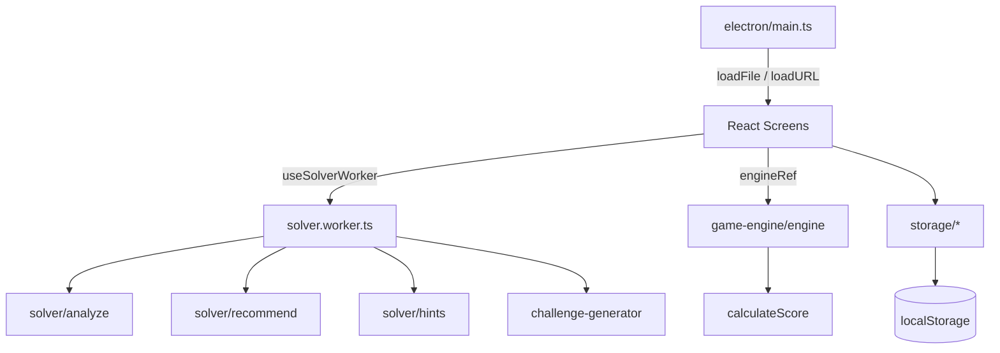

# ארכיטקטורת Super Mastermind

## מטרת המערכת

אפליקציית Desktop עצמאית (Windows) למשחק בול פגיעה (Mastermind) בעברית מלאה,
הכוללת מנוע משחק גמיש, ניתוח לוגי בזמן אמת, מצב "ניחוש מכריע", חידות ידניות,
סטטיסטיקות והיסטוריה — הכול מקומי, ללא רשת.

## טכנולוגיות

| שכבה | טכנולוגיה |
|---|---|
| מעטפת Desktop | Electron 33 |
| ממשק | React 18 + TypeScript (strict) |
| בנייה | Vite 6 (renderer), tsc (main process) |
| עיצוב | CSS גלובלי עם Custom Properties (ADR-002) |
| בדיקות | Vitest 3 |
| Lint | ESLint 9 (flat) + typescript-eslint + eslint-plugin-react-hooks |
| אריזה | electron-builder (portable + NSIS) |

## מבנה התיקיות

```text
electron/            תהליך ראשי + preload (TypeScript, מקומפל ל־dist-electron)
src/
  types/             טיפוסי הליבה — מקור אמת יחיד לכל המודולים
  game-engine/       חוקי המשחק: ציון, הגרלת סוד, אימות ניחוש, מנוע משחק
  solver/            מנייה, סינון, ניתוח, המלצות, רמזים, בדיקת חידה ידנית
  challenge-generator/  מחולל חידות "ניחוש מכריע"
  settings/          ברירות מחדל, תבניות קושי, אימות הגדרות
  storage/           שכבת localStorage: הגדרות, סטטיסטיקות, היסטוריה, חידות
  workers/           solver.worker.ts — כל החישובים הכבדים
  hooks/             useSolverWorker — פרוטוקול Promise מעל ה־Worker
  components/        רכיבי UI לשימוש חוזר (פג, פלטה, ציון, מודאל, ניתוח)
  screens/           ששת מסכי האפליקציה + חלון הוראות
  utils/             עזרים: פורמט עברי, ניקוד, צבע, צליל, הורדת קבצים
  tests/             כל הבדיקות (Vitest, סביבת Node — ללא DOM)
docs/                תיעוד הפרויקט
```

## עקרון מנחה: לוגיקה נקייה מ־React

`game-engine`, `solver`, `challenge-generator`, `settings`, `storage` ו־`utils`
הם TypeScript טהור — אפס תלות ב־React או ב־DOM (למעט `download.ts` ו־`sound.ts`
שהם עזרי דפדפן מוצהרים). לכן כולם נבדקים ישירות ב־Vitest בסביבת Node.

## זרימת נתונים



- **מנוע המשחק** נוצר פעם אחת לכל משחק ומוחזק ב־`useRef` — הרצף הסודי חי
  בתוך closure ואינו מגיע ל־state/DOM (ADR-003).
- **ה־Worker** מקבל הודעות `{ id, type, ...payload }` ומחזיר `{ id, ok, result|error }`.
  ה־hook ממפה id→Promise; תשובה שאיחרה את הרלוונטיות שלה נזרקת (דגל `stale`).
- **אחסון** — כל מפתח עטוף ב־`loadJson`/`saveJson` עם fallback בטוח (ADR-001).

## ניהול מצב

אין ספריית state חיצונית. ההגדרות חיות ב־`App` ועוברות כ־props; כל מסך מנהל
את המצב המקומי שלו. חוקי משחק "מוקפאים" בתחילת משחק (`gameRules` state) כך
ששינוי הגדרות חל רק על המשחק הבא.

לקח חשוב (תוקן): `useSolverWorker` מחזיר אובייקט חדש בכל רינדור (בגלל `busy`).
אפקטים חייבים להיתלות ב**פונקציות היציבות** (`solver.analyze` וכו'), לא באובייקט
כולו — אחרת נוצרת לולאת רינדור אינסופית.

## מנוע הניתוח (solver)

- `totalSpaceSize` — n^L עם כפילויות, n!/(n−L)! בלעדיהן.
- `enumerateAllCodes` — generator עצל; הצרכן עוצר מתי שרוצה.
- `computePossibleSet` — מנייה מדויקת עד 1,000,000 רצפים; מעבר לכך דגימה
  אקראית (60,000) והערכה עם דגל `estimated` (ADR-005).
- עובדות מיקום (לרמזים) מחושבות **רק** במצב מדויק — הערכה לא מייצרת רמז שגוי.
- `recommendGuess` — שלושה מצבים; המינימקס מוגבל ל־400 פתרונות + 150 מועמדים.

## מחולל החידות

ראו ADR-006: בכל שלב נבחר מועמד המקרב את מספר הפתרונות ליעד מדורג; מצב
פתרון־יחיד מוסיף ניחושים עד שנותר בדיוק אחד; עקביות מובטחת מבנית כי כל
הציונים מחושבים מול סוד אמיתי.

## Electron

תהליך ראשי מינימלי: חלון יחיד, `contextIsolation: true`, `sandbox: true`,
ללא `nodeIntegration`, ללא תפריט, מופע יחיד (single instance lock). אין IPC —
כל הלוגיקה ב־renderer. `preload.ts` ריק ומשמש נקודת הרחבה עתידית.

בפיתוח נטען `VITE_DEV_SERVER_URL`; ב־Production נטען `dist/index.html`
(עם `base: './'` כדי שנתיבים יחסיים יעבדו מתוך asar).

## אסטרטגיית בדיקות

ראו [TESTING.md](./TESTING.md). עיקרון: כל הלוגיקה מכוסה ביחידות בלי UI;
ה־UI אומת ידנית מול שרת Vite (מתועד בטבלת הבדיקות הידניות).

## מגבלות ביצועים

ראו [KNOWN_LIMITATIONS.md](./KNOWN_LIMITATIONS.md).

## נקודות הרחבה עתידיות

- שמירת משחק פעיל בין הפעלות (ידרוש סריאליזציה של הסוד — שיקול אבטחה).
- ביטול חישוב רץ ב־Worker (כרגע תשובות ישנות פשוט נזרקות).
- מעבר אחסון לקבצים דרך IPC — נקודתי בזכות שכבת `storage/local.ts`.
- ריבוי שפות — כל הטקסטים כרגע בעברית בתוך הרכיבים.
